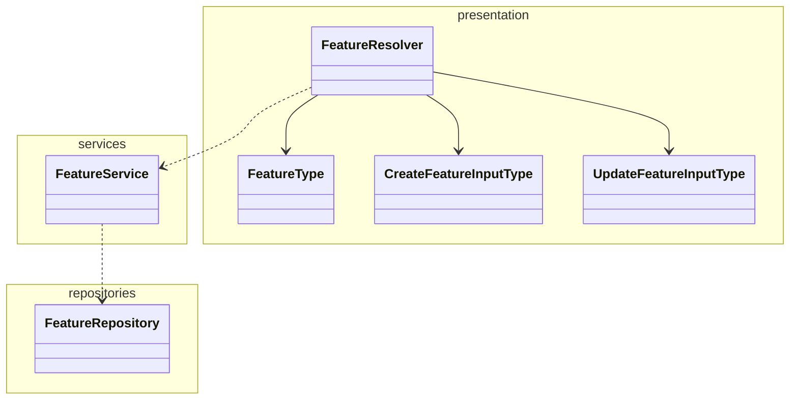

# Quacker Backend

A simplified version of proprietaryApplifting backend template for educational purposes.

## What's been set up for you

Compared to the bare bones Nest app you get when you create a new project, we also set this all up for you:

- **TypeScript Strict** mode
- **Prisma ORM**
- **Docker** and **Docker Compose** for local development (**Node.js** server and **Postgres** database)
- BetterAuth-based authentication - this should allow for easy extending with e.g. social login providers
- Example database entities (**Users**, **Quacks**, **Files**) with migrations
- Configured tests and resolve common issues with them in Nest (like proper path resolving)
- Decorator-based configuration with our `@applifting-io/nestjs-decorated-config` package
- GraphQL dataloaders with our `@applifting-io/nestjs-dataloader` package
- Real-time updates with GraphQL Subscriptions or Server-Sent Events
- File upload
- Unit tests
- **Winston-based logging** with file and console output

## Basic feature module architecture

Just a general example on how to structure a feature module, not a strict rule.



## Decisions explanation

- MariaDB running in Docker Compose for consistent development and production environments
- Prisma over TypeORM as it's newer, more type safe and offers a better developer experience overall
- Primarily code-first Apollo Graphql over Rest, same reasons as above
- BetterAuth library for authentication to provide battery-included solution for registering users, logging in, email verification etc. without having to re-invent the wheel

## Database Configuration

This project uses MariaDB running in Docker Compose for both development and production-like environments.

### Using MariaDB with Docker

1. Start the database and adminer:

```bash
yarn backend docker:up
```

2. Access Adminer at http://localhost:8080

   - Server: db
   - Username: quackerUser
   - Password: quackerPassword
   - Database: quacker

## Running in Development

```bash
yarn backend start:dev
```

## API Documentation

- **GraphQL Playground**: http://localhost:4000/graphql when the server is running
- **REST API Documentation (Swagger)**: http://localhost:4000/docs when the server is running

## Logging

The application uses **Winston** for centralized logging with both console and file output.

### Features

- **File Logging**: All logs are written to `app.log` in the backend root directory
- **Console Output**: Logs also appear in the terminal for development
- **Timestamped Entries**: Each log entry includes a timestamp
- **Context Support**: Logs can include context information for better debugging
- **NestJS Integration**: Replaces the default NestJS logger

### Log File Location

```
backend/app.log
```

### Usage in Services and Controllers

```typescript
import { Logger } from '@nestjs/common';

@Controller('example')
export class ExampleController {
  private readonly logger = new Logger(PubSubService.name);

  @Get()
  async getExample() {
    this.logger.log('Example endpoint accessed', 'ExampleController');

    try {
      // Your logic here
      this.logger.log('Operation completed successfully', 'ExampleController');
      return result;
    } catch (error) {
      this.logger.error(
        `Operation failed: ${error.message}`,
        undefined,
        'ExampleController',
      );
      throw error;
    }
  }
}
```

### Available Log Methods

- `logger.log(message, context)` - General information logging
- `logger.error(message, trace, context)` - Error logging
- `logger.warn(message, context)` - Warning logging
- `logger.debug(message, context)` - Debug logging

### Log Format

Logs are formatted with timestamps and context:

```
2025-09-16T00:01:37.697Z [INFO] [WelcomeController] Welcome endpoint accessed
```

# Installation

First, make sure that you provided all the necessary env variables in .env file using .env.example as a template.

```bash
$ yarn backend install
```

or

```bash
$ yarn backend docker:up # this will also install and start the database, preferred
```

### Running the app

```bash
# watch mode (you will mostly need this)
$ yarn backend start:dev

# production mode
$ yarn backend start:prod

# locally with docker compose (run in repo root) - will only run database for you now, you still need to run the server manually using the previous commands
$ yarn backend docker:up

# regenerate prisma schema and reseed data after changes
$ yarn backend seed
```

### Prisma

All Prisma commands should be run from the root directory of the project using the `yarn backend` prefix:

```bash
# generate Prisma client and seed DB
$ yarn backend seed
# open Prisma Studio to view/edit data
$ yarn backend prisma:studio
```

You actually do not need to manage migrations manually, the seed script by itself should be able to synchronize your database with the prisma schema.
This should be sufficient for the aim of this course (have a working application ready for presentation). Migrations are a topic you will have to deal with in the future if you're going to turn this into a real project.

### Test

There are currently any tests but there are still commands ready to run them if you want to add them later.

```bash
# unit tests
$ yarn backend test

# test with coverage (will generate a coverage report HTML files in the coverage folder)
$ yarn backend test:cov
```

### Better Auth

In this application, [**better-auth**](https://www.npmjs.com/package/better-auth) is utilized as the authentication module. It is designed to be easily extended with additional features or plugins, such as social login providers, multi-factor authentication, and more. Whenever database changes related to authentication are required, the following command should be run:

```bash
# propagate changes to the database schema (schema.prisma)
$ yarn backend auth:generate
```

Hopefully you won't need to use this command and the following part, unless you want to change how the auth works/add more features to it (better ask us if you're trying to/need to for your project):

Keep in mind that there are 2 better auth configurations, one in the src/shared/auth/providers/better-auth.provider.ts (the complete config that is being used in the whole app) and one in the src/shared/auth/config/better-auth.config.ts (this config is being used by the CLI command above). You need to add the necessary changes to the better-auth config file to generate new database schema changes.

### GraphQL playground

After running locally, go to http://localhost:4000/graphql to test GraphQL Playground

### Compodoc

Visualize the code structure, modules, classes etc.

```bash
# serve documentation
$ yarn backend docs:serve
```

### Prisma studio in Docker

If you want to run the app in docker, you can run prisma studio locally with the following command to access the data in docker:

```bash
# run in repo root
$ yarn backend docker:prisma:studio
```

### Email Service Adapters

This template offers some options for email service sending. It's simply configurable via injecting email adapters. You can find the adapters in the src/core/email folder. SMTP adapter should cover most of your cases or you can write your own adapter (e.g. using Mailchimp/Mailgun API etc.) if you decide you actually need sending emails from your application.

### MJML Email Template

You can check the application for how MJML templates are being used.
MJML is a framework for creating responsive emails. Check https://mjml.io/ for more information.

To create a new MJML email template, follow these steps:

1. **Create the MJML file**

   Add your MJML template file inside the `assets/templates/mjml` folder.  
   Example:  
   `assets/templates/mjml/example.mjml`

2. **Compile the MJML to HTML**

   Run the following command in your terminal while in the backend directory to convert the MJML file to HTML:

   ```bash
   npx mjml assets/templates/mjml/example.mjml -o assets/templates/html/example.html
   ```
